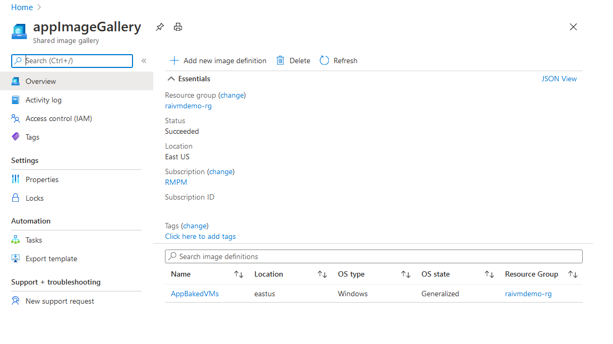
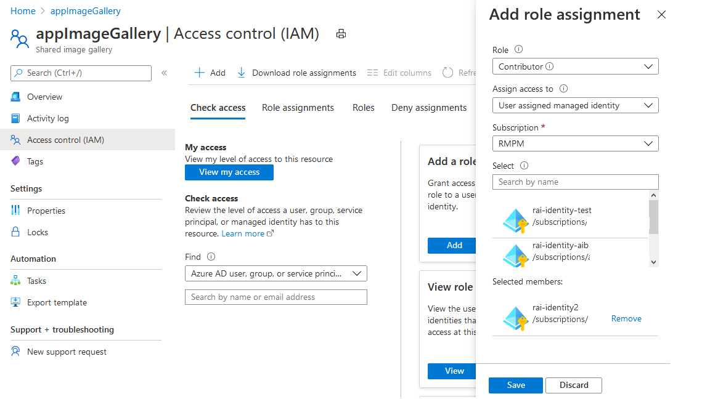

## Deploying Immutable Infratructure gets easier with Build Azure Virtual Machine Image Action

In a traditional mutable infrastrucuture, virtual machines are constantly updated for configuration changes, software installations, security hardening etc. It is a usual practice for developers or sysops teams to SSH into their virtual machines and install packages manually or run scripts. In other terms, the Virtual machine mutates regularly from its original state. 

As organizations mature, the number of virtual machines increases and the need for automation  arises in order to achieve consistency across machines. However, even with automation there are situations where a run fails or behaves slightly differently on a particular machine because of an events like network failure, OS update failure, installation retries etc. When seen across hundreds of virtual machines and across multiple updates, each virtual machine can behave slightly differnt from the rest. This leads to inconsistency, unreliability and errors that are unique per virtual machine.

To get rid of all the above problems, organizations are now moving towards immutable approach. Once a VM is created from an image, it is never changed. If a configuration needs to be updated or a new software version needs to be installed, this change is first done on a VM image, new VMs are created, tested and then the new image is distributed to be used for creating new VMs. As the traffic is redirected to these newer VMs, the older VMs are decommissioned. 

In order to help you with deploying immutable VMs, we have launched a new [Build Azure Virtual Machine](https://github.com/marketplace/actions/build-azure-virtual-machine-image) action. This action can help you get started very quickly on this journey. It primarily has 3 input categories:

- Source image: This is the image on which customizations will be done. You can use readily available [azure marketplace images](https://docs.microsoft.com/en-us/azure/virtual-machines/windows/cli-ps-findimage)  or provide one that has been customized and created by you. 
- Customizations: These are the steps that will be run on the source image. If your CI is in GitHub, then you can easily inject all your built artifacts/ scripts into the custom image and   run them for installation.
- Distribution: This is the distribution methodology to be used for the created custom image. This action supports [Shared Image Gallery](https://docs.microsoft.com/en-us/azure/virtual-machines/windows/shared-image-galleries), Managed Image or a VHD.

Note that internally this action behind the scenes leverages [Azure Image Builder](https://docs.microsoft.com/en-us/azure/virtual-machines/windows/image-builder-overview) service. All the inputs provided in the action are processed and submitted to Azure Image Builder service. 


### Sample Walkthrough: 

Lets now quickly see how you can easily start using this action. In the following sections, we'll describe a workflow that:

- Uses a Microsoft windows server platform image from Azure as the source image
- Injects a webapp to the image
- Configures IIS server on the image
- Distributes it to a Shared Image Gallery
- Creates a VM using the above created custom image


#### Pre-requisites:
- *Azure Login Credentials*: In the workflow we will be accessing resources in azure, so you'll need to generate your credentials and store it as a GitHub secret. This secret will be used by Azure Login Action. You can refer [configuring azure credentials for Azure login action](https://github.com/zenithworks/Custom_VM_Image#configure-credentials-for-azure-login-action) to create this.

- *Shared Image Gallery*: We will be uploading the created custom VM image to a shared image gallery. So this should already be present. Learn [how to create a Shared image gallery](https://docs.microsoft.com/en-us/azure/virtual-machines/windows/shared-images-portal#:~:text=In%20the%20Shared%20image%20gallery,the%20name%20of%20the%20gallery.). Remember to select "Windows" as the operating system when configuring the image definition in the Shared image gallery. This is because we will be customizing a windows image. Also the region should be same as one of the [regions supported](https://docs.microsoft.com/en-us/azure/virtual-machines/windows/image-builder-overview#regions) by Azure Image Builder. Select 'East US', if confused.



- *User Assigned Managed Identity*: A managed identity is required by Azure Image Builder to distribute images using Shared Image Gallery. For this you'll need to
  - Create a [user assigned managed identity](https://docs.microsoft.com/en-us/azure/active-directory/managed-identities-azure-resources/how-to-manage-ua-identity-cli)
  - Give permission to the above managed identity on the Shared Image Gallery. For this,
    - Visit the shared image gallery in Azure portal
    - Click on  *Access Control(IAM)* in the left section
    - Click on *Add* button in the *Add a role assignment* card. 
    - In the right blade, select 'Contributor' as the *Role*, 'User assigned managed identity' as *Assign access to* and the appropriate subscription
    - Then search the identity that you created in the previous step and click on it. It will show up in selected members section. Then click on *Save*.



 
#### GitHub Workflow

1. Checkout application code to the GitHub runner. For this example, my application code is in a webApp folder located at the root of the GitHub repository. The `checkout` step will download all the repository files in the location ${{ GITHUB.WORKSPACE }} in GitHub runner.

    ```yaml
    name: create_custom_vm_image
    on: [push]

    jobs:
      BUILD-CUSTOM-IMAGE:
        runs-on: windows-latest    
        steps:
        - name: Checkout
          uses: actions/checkout@v2    
    ```

2. Login to Azure. This steps takes the Azure login credentials (mentioned in prerequisites) from GitHub secret and logs into azure.

    ```yaml
        - name: Login via Az module
            uses: azure/login@v1
            with:
              creds: ${{secrets.AZURE_CREDENTIALS}}
    ```

3. Create custom image and distribute using Shared Image Gallery

    ```yaml
        - name: CREATE APP BAKED VM IMAGE
          id: imageBuilder
          uses: azure/build-vm-image@v0
          with:
            location: 'eastus'
            resource-group-name: 'raivmdemo-rg'
            managed-identity: 'rai-identity2' # Managed identity as mentioned in pre-requisites.

            source-os-type: 'windows'
            source-image-type: 'platformImage'
            source-image: MicrosoftWindowsServer:WindowsServer:2019-Datacenter:latest #unique  identitifier of source image

            customizer-source: '${{ GITHUB.WORKSPACE }}\webApp'  # This folder gets injected to the image at directory location C:\
            customizer-script: |
              & 'c:\webApp\webconfig.ps1' # This script configures IIS server

            dist-type: 'SharedImageGallery'
            dist-resource-id: '/subscriptions/${{ secrets.SUBSCRIPTION_ID }}resourceGroups/ raivmdemo-rg/providers/Microsoft.Compute/galleries/appImageGallery/images/AppBakedVMs/versions/0.1.${{ GITHUB.RUN_ID }}' #Replace with the resource id of your shared image  gallery's image definition
            dist-location: 'eastus'
    ```

4. Create a Virtual from the above image

    ```yaml
        - name: CREATE VM
          uses: azure/CLI@v1
          with:
            azcliversion: 2.0.72
            inlineScript: |
              az vm create --resource-group raivmdemo-rg  --name "app-vm-${{ GITHUB.RUN_NUMBER }}"  --admin-username moala --admin-password "${{ secrets.VM_PWD }}" --location  eastus \
              --image "${{ steps.imageBuilder.outputs.custom-image-uri }}"              

    ```


Here is a full yaml script including all the above 4 steps:


```yaml
    name: create_custom_vm_image
    on: [push]

    jobs:
      BUILD-CUSTOM-IMAGE:
        runs-on: windows-latest    
        steps:
        - name: Checkout
          uses: actions/checkout@v2    

        - name: Login via Az module
            uses: azure/login@v1
            with:
              creds: ${{secrets.AZURE_CREDENTIALS}}

        - name: CREATE APP BAKED VM IMAGE
          id: imageBuilder
          uses: azure/build-vm-image@v0
          with:
            location: 'eastus'
            resource-group-name: 'raivmdemo-rg'
            managed-identity: 'rai-identity2' # Managed identity as mentioned in pre-requisites.

            source-os-type: 'windows'
            source-image-type: 'platformImage'
            source-image: MicrosoftWindowsServer:WindowsServer:2019-Datacenter:latest #unique  identitifier of source image

            customizer-source: '${{ GITHUB.WORKSPACE }}\webApp'  # This folder gets copied tothe   image at location C:\
            customizer-script: |
              & 'c:\webApp\webconfig.ps1'

            dist-type: 'SharedImageGallery'
            dist-resource-id: '/subscriptions/${{ secrets.SUBSCRIPTION_ID }}resourceGroups/ raivmdemo-rg/providers/Microsoft.Compute/galleries/appImageGallery/images/AppBakedVMs/versions/0.1.${{ GITHUB.RUN_ID }}' #Replace with the resource id of your shared image  gallery's image definition
            dist-location: 'eastus'

        - name: CREATE VM
          uses: azure/CLI@v1
          with:
            azcliversion: 2.0.72
            inlineScript: |
              az vm create --resource-group raivmdemo-rg  --name "app-vm-${{ GITHUB.RUN_NUMBER }}"  --admin-username myusername --admin-password "${{ secrets.VM_PWD }}" --location  eastus \
              --image "${{ steps.imageBuilder.outputs.custom-image-uri }}"              
        
```


#### Result

On executing the above workflow, it will push a windows image to shared image gallery. The pushed image will be tagged with github repository and run details so that you can trace every image back to the workflow run and can understand the exact changes that were included in this. Also a VM is spun up from this image.  
